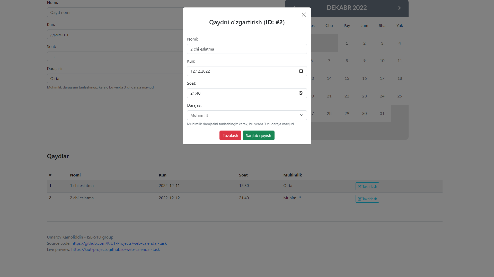

## 🖥 Web calendar task

Code by Umarov Kamoliddin ISE-51U

> Author: @UzSoftic
>
> Mail: softuzb[at]gmail[dot]com

## 🐙 Github (Source Code)
Github: https://github.com/KIUT-Projects/web-calendar-task

## Calendar Source
https://codepen.io/B8bop/pen/DOQJyJ

## Used packages
Bootstrap-5.2.3

Font-awesome v6.2.1

jQuery v2.1.3

## 📂 Download Source Code (v1.1):
Source: https://github.com/KIUT-Projects/web-calendar-task/archive/refs/tags/v1.1.zip

## 🌐 Live Preview
Live: https://kiut-projects.github.io/web-calendar-task

## 🖼 Screenshots:

